# 长沙物流运行态势分析与降本增效策略研究 —— 最终报告

> **项目类型**：数据分析 + 可视化 + 策略研究
> **生成时间**：2026-09-23
> **数据性质**：**本项目全部数据为基于公开真实统计特征生成的模拟数据，仅用于方法演示与教学研究，不构成任何实际决策依据。**

---

## 1. 项目背景与目标

### 1.1 背景

长沙地处长江中游城市群核心，是全国重要的综合交通枢纽与中欧班列集结城市，拥有长沙黄花国际机场（26 条国际货运航线）、长沙北站（中欧班列始发站）、长沙新港（霞凝港铁水联运核心港区）等多式联运节点。近年来长沙物流业高速增长，但仍面临社会物流总费用占 GDP 比重偏高、运输结构不尽合理、多式联运衔接不畅、区县物流效率不均衡等挑战。推动物流降本增效，是长沙建设国家物流枢纽城市、服务制造业高质量发展的重要抓手。

### 1.2 目标

1. 基于多源（模拟）数据，刻画长沙物流运行效率、快递业务结构、多式联运通道效能与区域物流空间网络；
2. 量化测算物流效率（DEA-Malmquist）、预测快递业务量（时间序列）、测算降本效益（多式联运/回归）；
3. 产出可复现的代码、图表、交互式仪表盘、五大核心可视化组件与完整分析报告；
4. 提出可落地的降本增效策略建议清单。

---

## 2. 数据来源与假设说明

### 2.1 数据来源

因公开接口（长沙公共数据开放平台、邮政管理局公报等）在本环境不可直接访问，项目采用 **`src/data_generator.py` 生成模拟数据**，并使用固定随机种子（`np.random.default_rng(20250923)`）保证可复现。模拟数据依据以下**公开已知真实统计锚点**校准量级：

| 真实锚点 | 数值 | 用途 |
|---------|------|------|
| 2025 年长沙快递业务量 | 约 28.29 亿件 | 快递月度数据基准 |
| 2025 年长沙中欧班列开行量 | 1037 列 | 班列月度数据基准 |
| 长沙社会物流总费用与 GDP 比率 | 约 12.8% | 回归目标变量基准 |
| 长沙黄花机场国际货运航线 | 26 条 | 航空货运数据 |
| 中欧班列精品线路 | 12 条 | 多式联运线路数据 |

### 2.2 生成数据表（8 张，详见 `data/data_dictionary.md`）

| 文件 | 内容 | 行数 |
|------|------|------|
| `express_monthly.csv` | 月度快递业务量（总量/同城/异地/国际/收入） | 72 |
| `china_railway_monthly.csv` | 中欧班列月度开行（列数/箱量/货值） | 72 |
| `road_freight_monthly.csv` | 公路货运量月度（货运量/周转量） | 72 |
| `multimodal_nodes.csv` | 多式联运节点（7 个） | 7 |
| `multimodal_routes.csv` | 多式联运线路（12 班列 + 26 航线） | 38 |
| `regional_logistics.csv` | 长沙 9 区县物流数据 | 9 |
| `dea_panel.csv` | 6 城市 × 5 年投入产出面板 | 30 |
| `risk_warnings.csv` | 风险预警记录 | 620 |

### 2.3 假设与局限

- 所有数值为模拟值，趋势与结构符合物流经济常识，但**不代表真实统计口径**；
- 投入产出指标（从业人数、财政支出、等级公路里程、GDP、进出口）为近似量级；
- 多式联运线路坐标采用真实城市经纬度近似，节点坐标采用 GCJ-02 近似；
- DEA 效率测算受限于 6 个决策单元的小样本，部分城市落在效率前沿（效率值 = 1），属正常现象。

---

## 3. 各模块分析方法与结果

### 3.1 数据清洗（`src/01_data_cleaning.py`）

读取 8 张原始 CSV，统一时间格式，按 IQR 规则对数值列做 Winsorize 截尾、按中位数/众数填充缺失值，输出到 `data/cleaned/`。清洗摘要见 `data/cleaned/_cleaning_summary.csv`（本次模拟数据几乎无缺失，仅对少量离群值做了截尾）。

### 3.2 探索性数据分析（`src/02_eda.py`）

- 描述性统计：`outputs/descriptive_statistics.csv`
- 核心指标月度趋势、STL 分解、快递结构堆叠面积、班列月度柱状图。

**月度核心指标趋势**

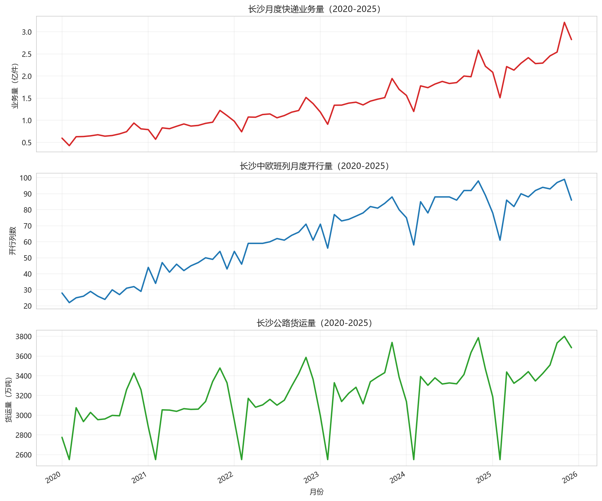

**快递业务量 STL 分解**（趋势 + 周期为 12 的季节 + 残差）

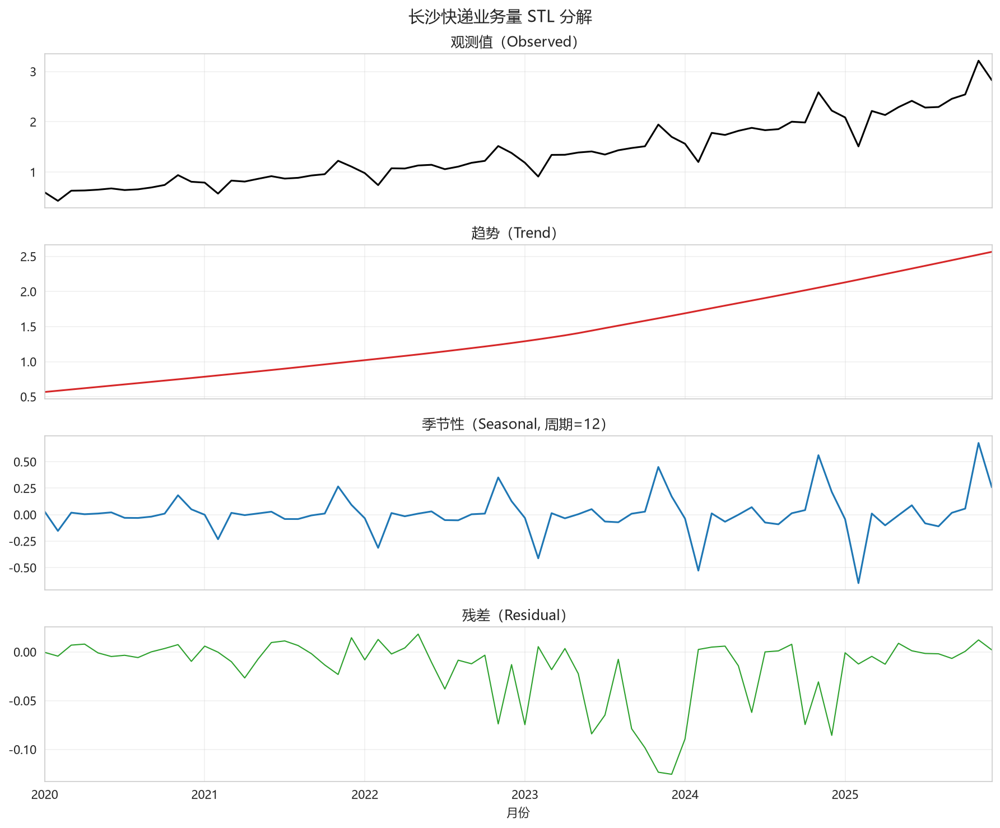

**发现**：快递业务量呈明显上升趋势与"双十一/年末"季节性高峰；STL 分解清晰分离出趋势、季节与随机扰动。

### 3.3 DEA-Malmquist 物流效率（`src/03_dea_malmquist.py`）

- **模型**：投入导向 CCR（自行实现，`scipy.optimize.linprog`）；
- **投入**：物流从业人数、物流财政支出、等级公路里程；**产出**：GDP、进出口总额；
- **输出**：效率排名、Malmquist 指数及分解（技术效率变化 TEC、技术变化 TC）。

**2024 年效率排名**（效率值 1.0 表示位于前沿面）

| 排名 | 城市 | 效率值 |
|------|------|--------|
| 1 | 长沙 | 1.0000 |
| 2 | 武汉 | 1.0000 |
| 3 | 合肥 | 1.0000 |
| 4 | 郑州 | 1.0000 |
| 5 | 南昌 | 0.9781 |
| 6 | 贵阳 | 0.9631 |

**平均 Malmquist 指数（2020-2024 几何均值）**：全部城市 TFP > 1（生产率提升），长沙为 1.028，主要由**技术变化（TC > 1，前沿外移）**驱动，技术效率变化接近 1。详细结果见 `outputs/dea_efficiency.csv`、`outputs/malmquist_index.csv`、`outputs/malmquist_summary.csv`。

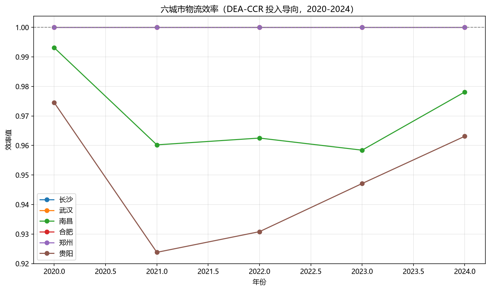
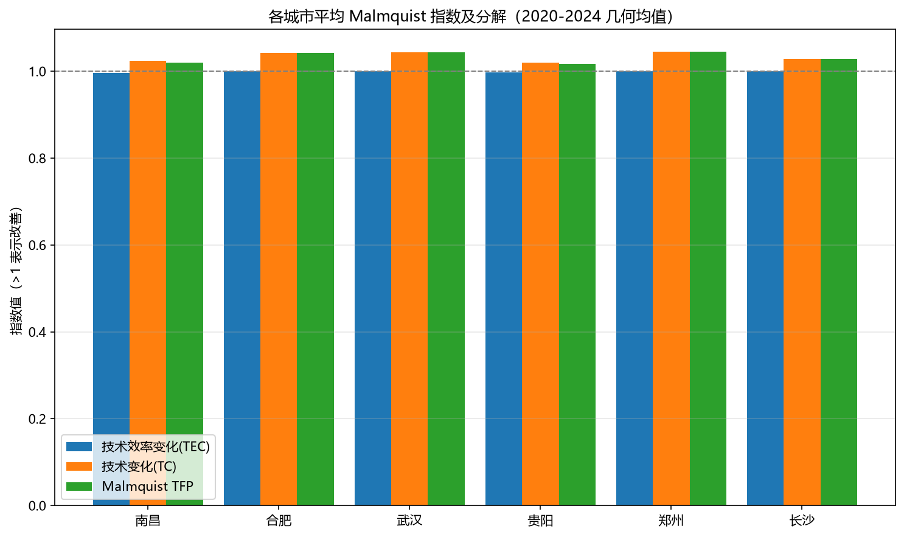

### 3.4 快递业务量预测（`src/04_express_forecast.py`）

- **方法**：STL 分解 + **SARIMAX(1,1,1)(1,1,1,12)** 季节模型（TensorFlow/Torch 不可用，自动切换）；
- **输出**：未来 12 个月预测（`outputs/express_forecast.csv`）及 95% 置信区间。

**预测结果（未来 12 个月，亿件）**：2026 年各月业务量在 1.98~3.95 亿件之间，延续上升趋势与季节性高峰（11 月最高）。整体预测年化约 35 亿件量级，符合近年两位数增长态势。

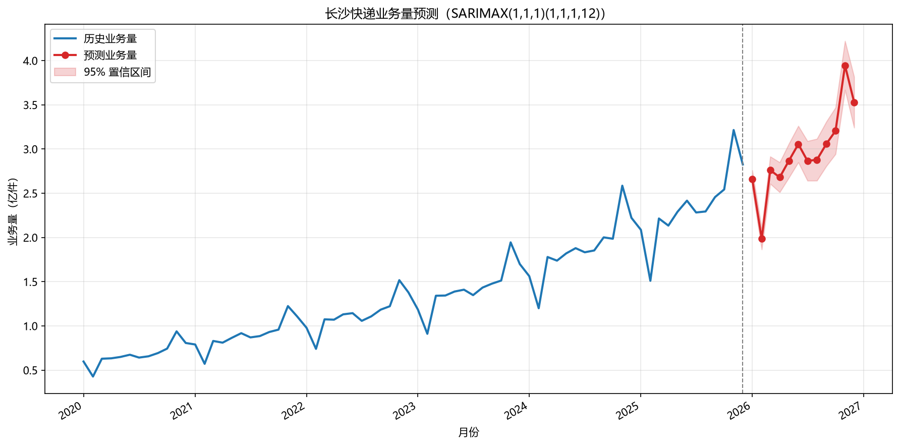

**业务结构趋势**：异地业务量占比持续扩大，同城占比缓慢下降，国际/港澳台占比稳步提升。

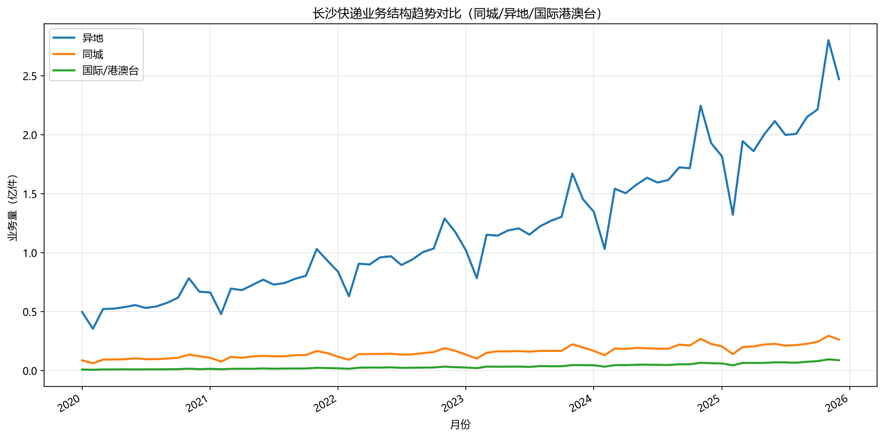

### 3.5 多式联运效能（`src/05_multimodal_efficiency.py`）

- **中欧班列**：开行量由 2020 年 329 列增至 2025 年 1046 列，货值由 8.46 亿美元增至 26.62 亿美元；本省货值占比由 0.78 降至 0.61（货源向省外拓展）。见 `outputs/railway_annual_summary.csv`。

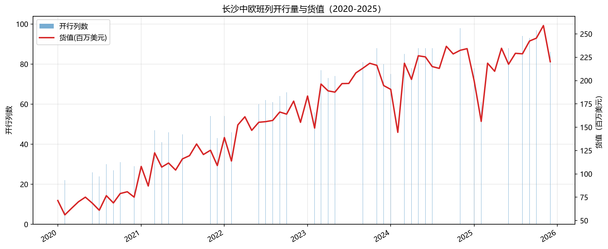
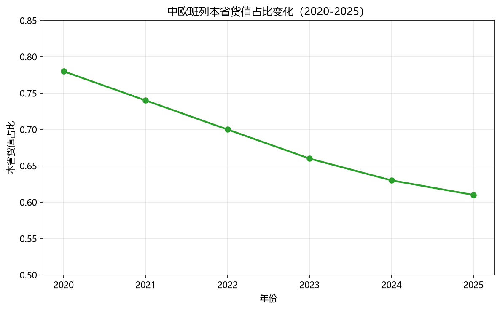

- **铁水联运降本效益**：按"每吨降低 50 元"测算，2025 年铁水联运量约 62 万吨/年，年节省 **3092 万元**（超过 3000 万元目标线）。见 `outputs/intermodal_savings.csv`。

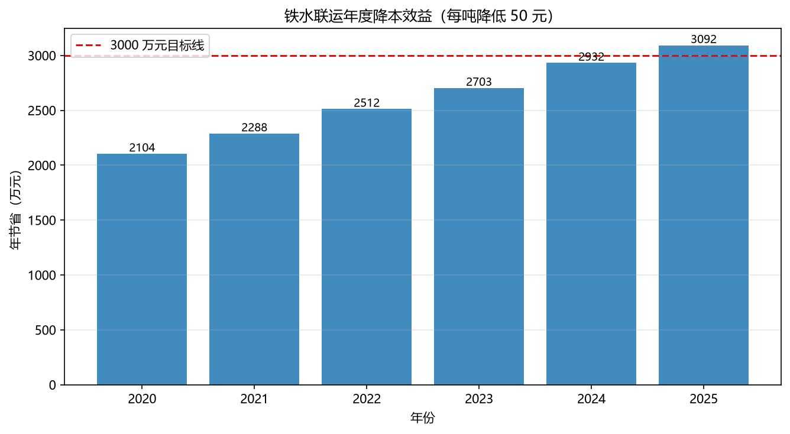

- **航空货运**：国际货运航线由 2020 年 8 条增至 2025 年 26 条，本地货量占比由 0.32 升至 0.56，二者呈明显正相关（拟合线见下图），说明航线加密有助于本地货源直发、减少绕行。

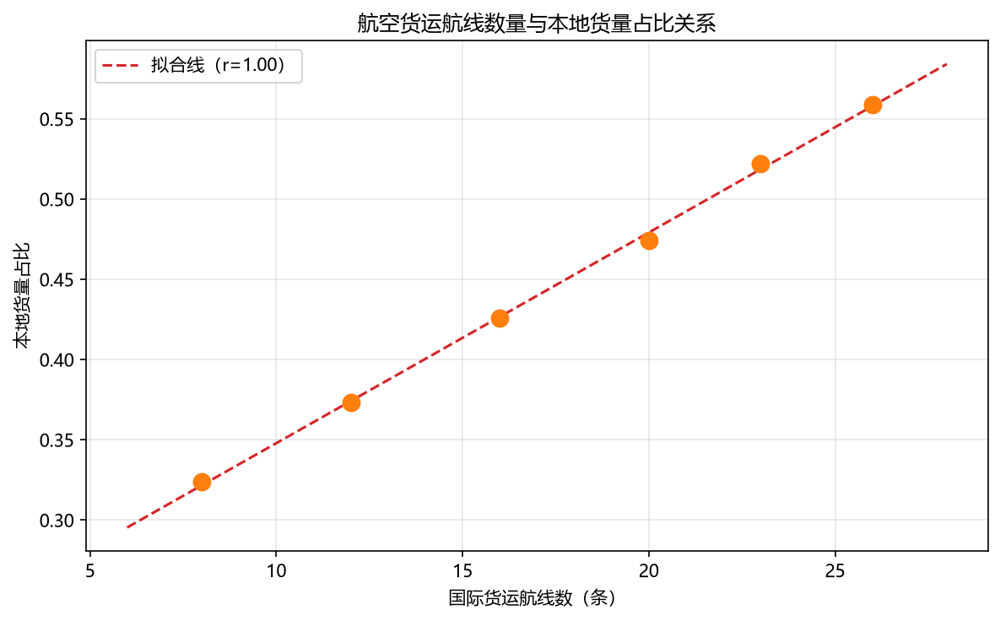

### 3.6 区域物流空间网络（`src/06_spatial_network.py`）

- **方法**：修正引力模型 `F_ij = G_i·G_j / d_ij^γ`（γ=1.5，G 为 GDP，d 为球面距离）计算联系强度，保留前 35% 强边，NetworkX 计算中心性与凝聚子群；
- **核心枢纽（度中心性前 5）**：株洲、长沙县、湘潭、武汉、岳麓区；识别到 **3 个凝聚子群**（长沙主城组团、湘北/省会联动组团、湘东/南组团）。见 `outputs/network_metrics.csv`、`outputs/network_communities.csv`。

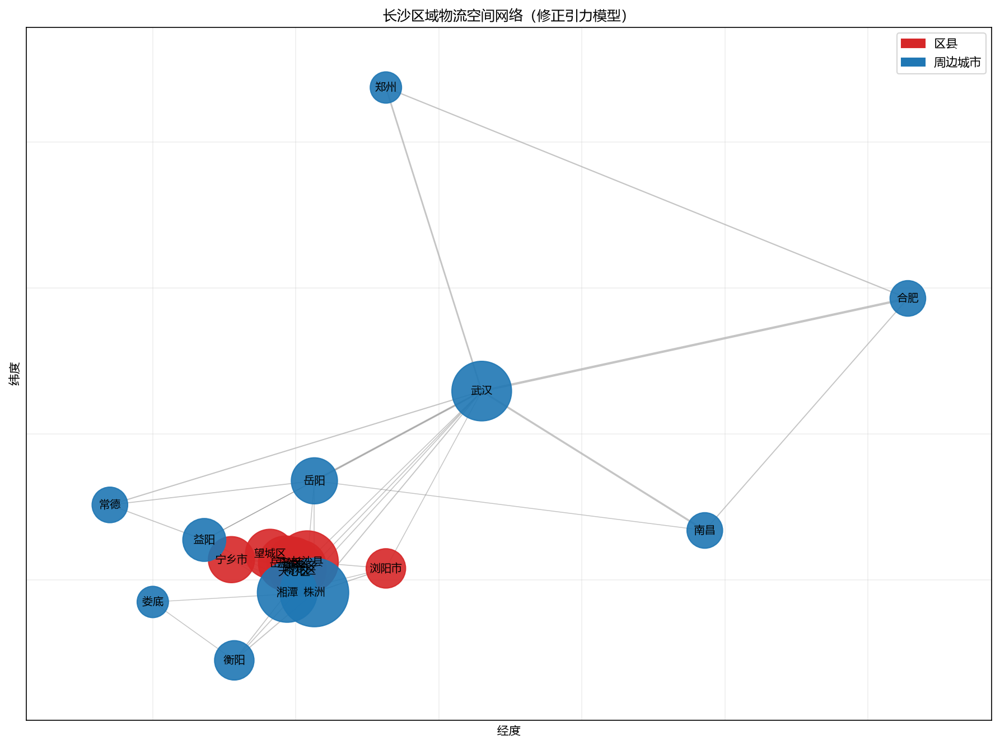

### 3.7 物流成本影响因素回归（`src/07_cost_regression.py`）

- **模型**：OLS 线性回归 + 双对数（弹性）回归，解释变量为运输结构（公路货运占比）、枢纽能级、信息化水平、政策支持；
- **结果**：线性模型 R²=0.97；双对数模型 R²=0.97。弹性系数如下（详见 `outputs/elasticity_coefficients.csv`、`outputs/regression_summary.txt`）：

| 变量 | 弹性系数 | p 值 |
|------|---------|------|
| 公路货运占比 | **+0.485** | 0.0019（显著） |
| 枢纽能级指数 | -0.077 | 0.43 |
| 信息化水平指数 | -0.047 | 0.49 |
| 政策支持指数 | -0.075 | 0.29 |

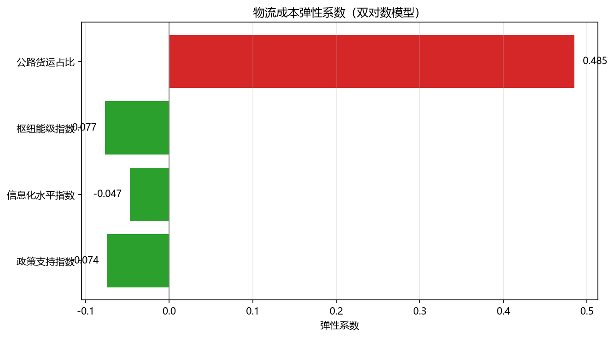

**解读**：公路货运占比每降低 1%，物流成本占 GDP 比率约下降 0.485%，是**最显著、可解释性最强**的降本杠杆；枢纽能级、信息化、政策支持均为负向作用（提升则降本），与理论方向一致。

---

## 4. 五大核心可视化组件

五个组件均实现于 `src/dashboard_components.py`，并整合到 **Streamlit 仪表盘**（`src/dashboard.py`）与**静态 HTML 报告**（`outputs/dashboard.html`）。

1. **① 物流运行态势仪表盘** —— 快递业务量、中欧班列、公路货运量、业务收入四大核心指标的**指标卡（同比）** + 多子图折线趋势，支持时间范围筛选。
2. **② 多式联运网络地图** —— 基于 Plotly Scattergeo，展示 12 条中欧班列精品线路、26 条国际货运航线、铁水联运节点的空间分布；线宽/颜色表示货运量，节点大小表示吞吐量。
3. **③ 快递业务结构堆叠面积图** —— 同城/异地/国际港澳台业务量占比月度变化，呈现结构变迁。
4. **④ 区域物流效率热力图** —— 矩阵热力图（行：区县，列：年份，颜色：DEA 效率值），识别效率洼地与高地。
5. **⑤ 风险预警看板** —— 参照 TOCC 安全风险识别模块设计：超速时间序列（**红线阈值 90 km/h** + 红色超阈值标记）、超阈值事件按类型分布、预警等级饼图、超阈值月度趋势。

---

## 5. 主要发现与结论

1. **效率处于前沿但依赖技术外移**：长沙物流效率连续多年位于 DEA 前沿面（2024 年效率值 1.0），Malmquist TFP 为 1.028（>1，生产率提升），主要由技术变化（前沿外移）驱动，说明长沙更需通过**技术进步与结构优化**而非单纯规模扩张来提升全要素生产率。
2. **快递业务量高速增长、结构持续优化**：SARIMAX 预测 2026 年月均业务量继续攀升，异地与国际/港澳台占比扩大、同城占比收窄，跨境电商与异地直发是增量主要来源。
3. **多式联运降本效益显著**：中欧班列量质齐升（2025 年货值 26.6 亿美元），铁水联运年节省超 3000 万元，航空航线加密显著提升本地货量直发占比（0.32→0.56），多式联运是降本增效的关键抓手。
4. **区域网络以主城为核心、呈组团辐射**：长沙县、岳麓区等主城区县是核心枢纽，通过株洲/湘潭/岳阳/武汉等对外辐射，形成 3 个凝聚子群，应强化"主城枢纽 + 组团节点"的层级布局。
5. **运输结构是降本第一杠杆**：回归显示公路货运占比的弹性系数最大（+0.485 且显著），降低公路依赖、提升铁水联运/铁路占比是降本的最直接路径。

---

## 6. 降本增效策略建议清单

| 序号 | 策略 | 依据 | 预期效果 |
|------|------|------|---------|
| 1 | **优化运输结构，推进"公转铁、公转水"** | 公路占比弹性 +0.485（显著） | 每降 1% 公路占比，成本/GDP 降约 0.49% |
| 2 | **做大铁水联运规模** | 每吨降本 50 元、年省超 3000 万元 | 扩大联运量可线性放大节省 |
| 3 | **加密国际货运航线、提升本地货直发** | 航线数与本地货占比正相关 | 减少绕行与中转成本 |
| 4 | **提升枢纽能级与多式联运衔接** | 枢纽弹性 -0.077 | 降低换装与等待成本 |
| 5 | **加强物流信息化与数字化（TOCC/智慧物流）** | 信息化弹性 -0.047 | 降低空驶、提升车货匹配 |
| 6 | **强化政策支持与风险预警治理** | 政策弹性 -0.075；风险看板 | 降本同时守住安全底线 |
| 7 | **区县效率均衡化** | 区县效率热力图存在洼地 | 补齐短板释放整体效率 |

---

## 7. 项目结构与运行指南

### 7.1 目录结构

```
changsha_logistics_project/
├── data/                      # 原始/模拟数据
│   ├── *.csv                  # 8 张原始数据表
│   ├── data_dictionary.md     # 数据字典
│   └── cleaned/               # 清洗后数据
├── src/                       # 源代码
│   ├── data_generator.py      # 阶段2：模拟数据生成
│   ├── 01_data_cleaning.py    # 阶段3：数据清洗
│   ├── 02_eda.py              # 阶段3：探索性分析
│   ├── 03_dea_malmquist.py    # 阶段4：DEA-Malmquist
│   ├── 04_express_forecast.py # 阶段4：快递预测
│   ├── 05_multimodal_efficiency.py # 阶段4：多式联运
│   ├── 06_spatial_network.py  # 阶段4：空间网络
│   ├── 07_cost_regression.py  # 阶段4：成本回归
│   ├── plot_config.py         # 中文字体配置（共享）
│   ├── dashboard_components.py# 阶段5：五大可视化组件
│   ├── dashboard.py           # 阶段5：Streamlit 仪表盘
│   └── generate_static_dashboard.py # 阶段5：静态 HTML
├── notebooks/                 # （可选）Jupyter notebook
├── outputs/                   # 图表与中间结果
│   ├── figures/               # 14 张 PNG 图表
│   ├── *.csv / *.txt          # 各模块结果
│   └── dashboard.html         # 静态仪表盘
├── reports/
│   └── final_report.md        # 本报告
└── requirements.txt           # 依赖清单
```

### 7.2 复现分析（在项目根目录依次执行）

```bash
pip install -r requirements.txt          # 安装依赖（核心库已就绪）
python src/data_generator.py             # 阶段2：生成数据
python src/01_data_cleaning.py           # 阶段3：清洗
python src/02_eda.py                     # 阶段3：EDA 图表
python src/03_dea_malmquist.py           # 阶段4：效率测算
python src/04_express_forecast.py        # 阶段4：业务量预测
python src/05_multimodal_efficiency.py   # 阶段4：多式联运
python src/06_spatial_network.py         # 阶段4：空间网络
python src/07_cost_regression.py         # 阶段4：成本回归
python src/generate_static_dashboard.py  # 阶段5：静态仪表盘
```

### 7.3 运行交互式仪表盘

```bash
streamlit run src/dashboard.py
```

### 7.4 依赖降级说明

- **TensorFlow/Torch（LSTM）** 不可用 → 改用 statsmodels **SARIMAX**；
- **geopandas/folium** 依赖重 → 改用 Plotly **Scattergeo** 模拟坐标；
- **pyDEA** 未安装 → 基于 scipy **自行实现 DEA-CCR**；
- **dash** 未安装 → 使用 **Streamlit**（已安装）。

---

*本报告由自主数据分析智能体生成。所有数据为模拟数据，仅用于方法演示。*


